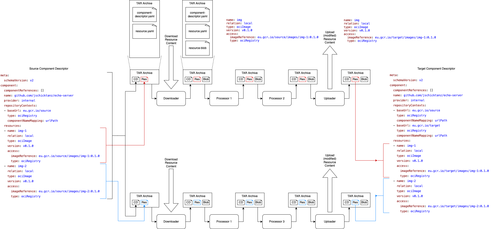

# Component CLI

This repository contains a cli tool to upload component descriptors as defined by the [CTF](https://gardener.github.io/component-spec/).

See the cli help (`component-cli --help`) or the [generated documentation](./docs/reference/component-cli.md) for detailed documentation details.

#### Usage

1. Get the latest release with:
   ```
   curl -L https://github.com/gardener/component-cli/releases/download/$(curl -s https://api.github.com/repos/gardener/component-cli/releases/latest | jq -r '.tag_name')/componentcli-linux-amd64.gz | gzip -d > ./component-cli
   ```
   > This example downloads the linux amd64 binary. Make sure to replace the system information with yours.

   To download a specific version, replace `$(curl -s https://api.github.com/repos/gardener/component-cli/releases/latest | jq -r '.tag_name')` with the specific version.
   ```
   curl -L https://github.com/gardener/component-cli/releases/download/v0.9.0/componentcli-linux-amd64.gz | gzip -d > ./component-cli
   ```

2. Make the binary executable and install the binary
   ```
   chmod +x ./component-cli
   mv ./component-cli /usr/local/bin/component-cli
   ```
3. Ensure the cli is correctly installed
   ```
   component-cli version
   ```


##### Build from Source

Install the cli tool locally by running `make install` or `go install ./cmd/...`.
The cli is installed into `$GOBIN/component-cli` and can be used accordingly.

In addition, an OCI Image is provided `docker run eu.gcr.io/gardener-project/component/cli --help`

### Development

#### Adding a new command

Commands of the cli are hierarchically defined in [pkg/commands](./pkg/commands).
When a new command should be added make sure to commply to the google docs guidline for cli command (https://developers.google.com/style/code-syntax#required-items).

### Transport
The `transport` subcommand copies [Open Component Model (OCM)](https://github.com/gardener/component-spec) based applications between OCI registries or CTF artifacts. The command supports copy-by-reference and copy-by-value. Copy-by-reference only copies the component descriptors. Copy-by-value additionally copies all resources to new locations.

The basic flow of the `transport` subcommand is the following
```
- load component descriptor and all component references
- for componentDescriptor : componentDescriptors
    - if copy-by-value
        - for every resource : componentDescriptor.Resources
          - download resource content from source location
          - upload resource content to target location
          - set resource.Access to target location
    - upload patched component descriptor
```

If copy-by-value is enable, it is possible to modify resources during the resource copy process, see [here](#modifying-resources).

#### Configuration
The configuration for downloading and uploading the resources is handed over via the cli option `--transport-cfg-path`. The variable must point to a valid config file. The following snippet shows a basic config file for downloading and uploading resources of types `localOciBlob` and `ociImage`. It defines 1 downloader and 1 uploader for each resource type and matches these definitions to the actual resources via the `filters` attribute.

```yaml
meta:
  version: v1

downloaders:
- name: 'oci-artifact-downloader'
  type: 'OciArtifactDownloader'
  filters:
  - type: 'ResourceTypeFilter'
    spec:
      includeResourceTypes:
      - 'ociImage'
- name: 'local-oci-blob-downloader'
  type: 'LocalOciBlobDownloader'
  filters:
  - type: 'AccessTypeFilter'
    spec:
      includeAccessTypes:
      - 'localOciBlob'

uploaders:
- name: 'oci-artifact-uploader'
  type: 'OciArtifactUploader'
  spec:
    baseUrl: 'eu.gcr.io/target/images'
    keepSourceRepo: false
  filters:
  - type: 'ResourceTypeFilter'
    spec:
      includeResourceTypes:
      - 'ociImage'
- name: 'local-oci-blob-uploader'
  type: 'LocalOciBlobUploader'
  filters:
  - type: 'AccessTypeFilter'
    spec:
      includeAccessTypes:
      - 'localOciBlob'
```

Every resource that gets processed is matched against the filter definitions of each downloader and uploader. In order to work correctly, every resource must match against exactly 1 downloader and 1..n uploaders from the config file. There are builtin downloaders and uploaders, and also the possibility to extend the framework via external downloaders and uploaders, see [here](#extensions).

##### Modifying resources
Additionally to only downloading and reuploading resources, resources can be modified during the process. The units that perform the modifications are called *processors* and are defined in the config file. As with downloaders and uploaders, there are builtin processors, and also the possibility to extend the framework via external processors, see [here](#extensions).

The following snippet shows a config file for removing files from OCI artifact layers. It defines 2 processors of type `OciImageFilter` which should remove the *bin* and *etc* directories from all layers of an OCI artifact. These processors are matched against actual resources via `processingRules`. Every resource that gets processed is matched against the filter definitions of each processing rule. If all filters of a rule match, then the resource will get processed by the processors defined in the rule. It is possible that a resource matches 0..n processing rules.

```yaml
meta:
  version: v1

downloaders:
  ...

uploaders:
  ...

processors:
- name: 'remove-bin-dir'
  type: 'OciImageFilter'
  spec:
    removePatterns:
    - 'bin/*'
- name: 'remove-etc-dir'
  type: 'OciImageFilter'
  spec:
    removePatterns:
    - 'etc/*'

processingRules:
- name: 'remove-bin-dir-from-test-component-images'
  processors:
  - name: 'remove-bin-dir'
    type: 'processor'
  filters:
  - type: 'ComponentNameFilter'
    spec:
      includeComponentNames:
      - 'github.com/test/test-component'
  - type: 'ResourceTypeFilter'
    spec:
      includeResourceTypes:
      - 'ociImage'
- name: 'remove-etc-dir-from-all-images'
  processors:
  - name: 'remove-etc-dir'
    type: 'processor'
  filters:
  - type: 'ResourceTypeFilter'
    spec:
      includeResourceTypes:
      - 'ociImage'
```

##### Repository Context Override
It is possible to load component descriptors from different OCI registries via the cli option `--repo-context-override-cfg`. It must point to a config file where the source repository contexts of component descriptors can be explicitely mapped. When downloading the source component descriptors, the program will first look into the repository context override file and try to match a component descriptor against each override definition. If no override matches, the default repository context from the cli option `--from` will be used. The following snippet shows a configuration, where the component `github.com/test/test-component` will be loaded from the repository context with base URL `eu.gcr.io/override`.

```yaml
meta:
  version: v1
overrides:
- repositoryContext:
    baseUrl: 'eu.gcr.io/override'
    componentNameMapping: urlPath
    type: ociRegistry
  componentNameFilterSpec:
    includeComponentNames:
    - 'github.com/test/test-component'
```

#### Extensions
A pipeline for processing a single resource must consist of 1 downloader, 0..n processors, and 1..n uploaders. For each resource that gets processed, a unique chain of downloader, processors, and uploaders is created and is created based on the definitions in the config file. The elements in a chain are then called sequentially.



The downloader is the first element in a chain. It receives a TAR archive which contains 2 files. The first file is `component-descriptor.yaml` which contains the component descriptor in YAML format. The second file is `resource.yaml` which contains the YAML of the resource for which the chain is called. The downloader must then download the actual resource content based on this information. Once the content is downloaded, the downloader builds a new TAR archive for passing the information to subsequent processors. This TAR archive contains the `component-descriptor.yaml` and `resource.yaml`, and additionally the serialized resource content as a single blob file.

The subsequent processors can open the TAR archive, deserialize the resource content, perform the modifications to either the `resource.yaml` or the actual resource content, and again serialize the content for subsequent processors. Beware that the serialization format of all processors in a chain must match.

At the end of a processing pipeline are 1..n uploaders. They publish the resource content to a sink (OCI registry, CTF archive, S3 bucket, ...). As with the preceding steps, uploaders must also build a new TAR archive and pass the information to subsequent uploaders. Beware that uploaders must update the `access` attribute in the `resource.yaml` to point to the new resource location.

After all uploaders run through, the orchestrating program collects the modified `resource.yaml` files from the TAR archive and replaces the original resources in the component descriptor. The original component descriptor now contains the updated resources. As a final step, the modified component descriptor is uploaded.

Every stage of resource processing (downloaders, processors, uploaders) is extensible. An extension is a static binary, which reads a TAR archive as input (either via stdin or Unix Domain Sockets), performs its modifications, and then outputs a TAR archive with the modified content via stdout or Unix Domain Sockets. To describe extensions in the config file, use `type: 'Executable'` in the downloader/processor/uploader definition. The following snippet shows the definition of an extension processor.

```yaml
processors:
- name: 'test-extension'
  type: 'Executable'
  spec:
    bin: '/path/to/binary'
    args:
    - '--test-arg'
    - '42'
    env:
      TEST_ENV: '42'
```

When creating extensions, some details must be considered. 

##### General points:
- One can chose whether the extension binary should support communication via stdin/stdout, Unix Domain Sockets, or both.

- Modifications of the component-descriptor.yaml file in a TAR archive are ignored when reuploading component descriptors and should therefore not be performed.

- The extension must read the input stream in a non-blocking fashion (e.g. directly write to temp file). If the stream is directly consumed as a TAR file, the writing side might block for large resources, as the TAR archive must first be completely written before it can be opened on the reading side.

- Beware that the serialization formats of the resource content must match between the downloader, processors, and uploaders of a resource processing chain. The serialization format is therefore an unseen part of the processor interface.

##### Points when usind Unix Domain Sockets:
- For Unix Domain Sockets, the calling program will set an environment variable which indicates the URL under which the Unix Domain Socket server of the extension binary should start. The calling program will try to connect to the extension via this URL.

- The extension program must stop the Unix Domain Socket server and stop, once it receives SIGTERM from the calling program.

- The extension program should remove the socket file in the file system once the program finishes.

##### Points when using stdin/stdout
- When using stdin/stdout for reading and writing processor TAR archives, beware that no other output like log data is allowed to be written to stdout. This data would otherwise interfere with the program data.
